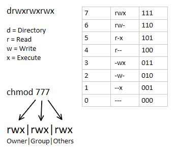

# Sistemas Operativos en Red - Unidad 1: Automatización
## Introducción a la Automatización
Automatizar tareas consiste en crear scripts (**archivos de texto con comandos**) que el sistema ejecuta automáticamente.
Sirven para ahorrar tiempo, evitar errores y mantener los sistemas funcionando sin intervención manual. Algunos ejemplos de tareas que se pueden automatizar incluyen la gestión de archivos, la instalación de software y la configuración de servicios.

Para lograr esto, se pueden utilizar diferentes herramientas y enfoques, dependiendo del sistema operativo en uso, los objetivos a alcanzar y las preferencias del administrador. Por un lado necesitamos un lenguaje de scripting que nos permita escribir estos scripts y por otra parte sistemas de automatización que faciliten su ejecución y gestión.

Los lenguajes de scripting son lenguajes de programación interpretados diseñados para facilitar la creación de scripts. Algunos de los lenguajes de scripting más populares incluyen:

- **Bash**: Utilizado principalmente en sistemas Linux (y Unix), donde viene preinstalado. Aunque también es posible utilizarlo en Windows a través de herramientas WSL para realizar ciertas tareas.
- **Python**: Lenguaje de programación, utilizado también para scripting por su simplicidad, legibilidad y amplia biblioteca de librerías.
- **PowerShell**: Método estándar en sistemas Windows para la automatización de tareas.
- **JavaScript**: En desarrollo web, puede ser utilizado para scripting del lado del servidor.

Los lenguajes de scripting son solo una parte de la automatización. También se requieren herramientas y sistemas que faciliten la ejecución y gestión de los scripts. Algunas de estas herramientas incluyen:

- **Cron**: Utilizado en sistemas Linux (y Unix) para programar tareas que se ejecutan en intervalos regulares.
- **Systemd**: En sistemas Linux modernos, se utiliza para gestionar servicios y puede ejecutar scripts en respuesta a eventos del sistema.
- **Task Scheduler**: Herramienta de Windows que permite programar la ejecución de scripts y tareas en momentos específicos.
- **Ansible**: Herramienta de automatización que permite gestionar configuraciones y despliegues.


## Automatización en Linux
En Linux, la automatización se realiza principalmente mediante scripts de Bash y herramientas del sistema como Cron y Systemd que permiten programar y ejecutar esas tareas automáticamente, en momentos específicos o en respuesta a eventos del sistema. 

La estructura de un script de Bash es bastante simple. Comienza con la línea shebang (`#!/bin/bash` bash en este caso), que indica al sistema que programa debe interpretar el contenido del script. Este programa puede ser el propio Bash o cualquier otro intérprete de comandos, como Python (`#!/usr/bin/python`) o JavaScript (`#!/usr/bin/node`). A continuación, se pueden incluir una serie de comandos que se ejecutarán de forma secuencial. Por ejemplo:

```bash
#!/bin/bash
# Script de ejemplo
echo "Hola, mundo"
```

```bash
#!/usr/bin/python
# Script de ejemplo en Python
print("Hola, mundo")
```

```bash
#!/usr/bin/node
// Script de ejemplo en JavaScript
console.log("Hola, mundo");
```

Cabe aclarar que de hecho, los tres scripts anteriores, son scripts Bash. De hecho, si le pasáramos los ejemplos anteriores al intérprete de Python o JavaScript, obtendríamos un error. Lo que sucede cuando los ejecutamos con Bash es que Bash lee la primera línea del script para determinar qué intérprete utilizar en el resto del archivo.

De ahora en adelante nos centraremos en el scripting con **Bash**. 

Al utilizar Bash, podemos utilizar exactamente los mismos comandos que utilizamos en la terminal. Reciprocamente, cualquier fragmento de script que escribamos en Bash puede ser ejecutado directamente en la terminal.

### Permisos
Recuerdo que como funcionan los permisos en linux, cada archivo y directorio tiene un conjunto de permisos que determinan quién puede leer, escribir o ejecutar el archivo. Estos permisos se dividen en tres categorías: usuario propietario, grupo propietario y otros. Para ver los permisos de un archivo, se puede utilizar el comando `ls -l`, que muestra una lista detallada de los archivos y sus permisos. 

Los símbolos que se utilizan para representar los permisos son:

- `r`: Permiso de lectura
- `w`: Permiso de escritura
- `x`: Permiso de ejecución
- `-`: Sin permiso

Las 3 primeras posiciones representan los permisos del propietario, las 3 siguientes los del grupo y las 3 últimas los de otros. 



Los permisos se pueden modificar utilizando el comando `chmod`, que permite cambiar los permisos de lectura, escritura y ejecución de archivos y directorios. Con `chmod`, se pueden agregar o quitar permisos de forma específica.

```bash
# Agregar permiso de ejecución para el propietario
chmod u+x nombre_del_script.sh
# Agregar permiso de lectura para el grupo
chmod g+r nombre_del_script.sh
# Quitar permiso de ejecución para el propietario
chmod u-x nombre_del_script.sh
# Agregar permiso de escritura a todos
chmod +w nombre_del_script.sh
```

Los permisos predeterminados de un archivo nuevo vienen dados por la máscara de creación de archivos (umask) del usuario. Se puede utilizar el comando `umask` para ver la configuración actual de la máscara. 

Para que un script de Bash pueda ser ejecutado, es necesario que tenga permisos de ejecución. Le podemos agregar permisos de ejecución con el siguiente comando:

```bash
# Agregar permiso de ejecución a todos
chmod +x nombre_del_script.sh
```

### Cron
Cron es una herramienta de Linux que permite programar la ejecución de scripts y comandos en momentos específicos. Utiliza un archivo de configuración llamado "crontab" (cron table) donde se definen las tareas programadas.

Para editar el crontab del usuario actual, se utiliza el comando:

```bash
crontab -e
```

La sintaxis de una entrada en el crontab es la siguiente:

```
* * * * * /ruta/al/script
```

Donde los asteriscos representan:

- Minuto (0-59)
- Hora (0-23)
- Día del mes (1-31)
- Mes (1-12)
- Día de la semana (0-7) (donde 0 y 7 representan el domingo)

Por ejemplo, para ejecutar un script todos los días a las 2:30 AM, se podría agregar la siguiente línea al crontab:

```
30 2 * * * /ruta/al/script.sh
```

Tambien teneis en el propio archivo de configuración crontab, comentarios que explican su funcionamiento.

Cron ejecuta estos scripts a través del servicio crond, que se ejecuta en segundo plano y verifica periódicamente el crontab en busca de tareas programadas. Por lo que es necesario que este servicio esté en funcionamiento para que las tareas programadas se ejecuten correctamente.

```bash
# Comprobar el estado de crond
systemctl status crond

# Iniciar el servicio crond
systemctl start crond

# Habilitar el inicio automático de crond
systemctl enable crond
```

Si el servicio no está en funcionamiento o el sistema está apagado en el momento en que una tarea programada debería ejecutarse, esa tarea no se ejecutará. Ademas si el servicio se inicia después de que se perdió la oportunidad de ejecutar la tarea, esta no se ejecutará retroactivamente.

### Systemd
Systemd es un sistema de gestión de servicios para Linux.

Para crear un servicio en Systemd, se debe crear un archivo en el directorio `/etc/systemd/system/`. Este archivo define cómo se debe iniciar, detener y gestionar el servicio.

Un ejemplo básico de un archivo de unidad para un script de Bash podría ser:

```
[Unit]
Description=Mi Script de Bash

[Service]
ExecStart=/ruta/al/script.sh

[Install]
WantedBy=multi-user.target
```

Una vez creado el archivo de servicio, se pueden utilizar los siguientes comandos para gestionar el servicio:

```bash
# Iniciar el servicio
systemctl start nombre_del_servicio

# Detener el servicio
systemctl stop nombre_del_servicio

# Habilitar el inicio automático del servicio
systemctl enable nombre_del_servicio

# Deshabilitar el inicio automático del servicio
systemctl disable nombre_del_servicio
```

Systemd es una herramienta mas potente y flexible que Cron, ya que permite gestionar servicios completos y responder a eventos del sistema, no solo ejecutar tareas en momentos específicos.

### Bash
Teneis en el archivo "ResumenScripting.pdf" todo lo relativo a este tema.

## Automatización en Windows
En Windows, la automatización se realiza principalmente mediante scripts de PowerShell y herramientas del sistema como el Programador de Tareas (Task Scheduler) que permiten programar y ejecutar esas tareas automáticamente, en momentos específicos o en respuesta a eventos del sistema.xw

### Programador de Tareas (Task Scheduler)
El Programador de Tareas de Windows permite programar la ejecución de scripts y programas en momentos específicos o en respuesta a eventos del sistema. Para crear una tarea programada, se puede seguir estos pasos:
1. Abrir el Programador de Tareas (Task Scheduler) desde el menú de inicio.
2. Seleccionar "Crear Tarea Básica" en el panel derecho.
3. Seguir el asistente para definir el nombre, la descripción, el desencadenador y la acción a realizar.
4. Especificar el script o programa que se desea ejecutar.
5. Finalizar el asistente para crear la tarea.

### PowerShell
PowerShell es un lenguaje de scripting y una interfaz de línea de comandos desarrollada por Microsoft para la automatización de tareas en sistemas Windows. PowerShell permite a los administradores y usuarios crear scripts para gestionar y automatizar diversas tareas del sistema operativo.

Un script de PowerShell termina con la extensión `.ps1` y puede contener una serie de comandos y funciones que se ejecutan secuencialmente. Por ejemplo, un script simple que imprime "Hola, mundo" en la consola podría verse así:

```powershell
Write-Host "Hola, mundo"
```

Para ejecutar un script de PowerShell, se puede abrir la consola de PowerShell y navegar hasta el directorio donde se encuentra el script. Luego, se puede ejecutar el script utilizando el siguiente comando:

```powershell
.\nombre_del_script.ps1
```
Es importante tener en cuenta que, por razones de seguridad, la ejecución de scripts de PowerShell puede estar restringida por la política de ejecución del sistema. Para permitir la ejecución de scripts, se puede cambiar la política de ejecución utilizando el siguiente comando en una consola de PowerShell con privilegios de administrador:

```powershell
Set-ExecutionPolicy RemoteSigned
```

Esto permite la ejecución de scripts locales y de scripts descargados de Internet que estén firmados por un editor confiable.

_(Falta añadir cosas sobre PowerShell)_

## Entrega
### Linux
- Deberéis crear un script de Bash con el siguiente contenido. Reemplazando las rutas de origen y destino por las que queráis utilizar.

```bash
#!/bin/bash
# 1. Carpeta de origen (la que se quiere copiar)
ORIGEN="/home/__________"

# 2. Carpeta de destino (donde se guardará la copia)
DESTINO="/home/__________/backup"

# 3. Crear la carpeta de destino si no existe
if [ ! -d "$DESTINO" ]; then
    mkdir -p "$DESTINO"
fi

# 4. Copiar todos los archivos del origen al destino
cp -r "$ORIGEN"/* "$DESTINO"

# 5. Registrar la fecha y hora del backup en un archivo log
FECHA=$(date +"%d/%m/%Y %H:%M:%S")
echo "Copia realizada el $FECHA" >> "$DESTINO/backup_log.txt"

echo "Copia completada correctamente."
```

- Deberéis guardar este script con el nombre `<nombre>Script.sh`. Donde `<nombre>` es vuestro nombre. Despues le deberéis dar permisos de ejecución.
- Deberéis programar este script para que se ejecute cada 10 minutos utilizando cron.
- Debereis entregarme una captura de pantalla en la que se vean los permisos del script, mostrando que tiene permiso de ejecución.
- Deberéis entregarme una captura de pantalla de la configuración del crontab en la que se vea la línea que habéis añadido para programar el script.
- En las capturas se debera ver el usuario con vuestro nombre.

### Windows
- Deberéis crear un script de PowerShell con el siguiente contenido. Reemplazando las rutas de origen y destino por las que queráis utilizar.
  
```powershell
# 1. Ruta de origen (carpeta que se quiere copiar)
$origen = "C:\__________"

# 2. Ruta de destino (donde se guardará la copia)
$destino = "C:\__________"

# 3. Crear la carpeta de destino si no existe
if (-not (Test-Path $destino)) {
    New-Item -ItemType Directory -Path $destino
}

# 4. Copiar todos los archivos del origen al destino
Copy-Item -Path $origen\* -Destination $destino -Recurse -Force

# 5. Registrar la fecha y hora del backup en un archivo log
$fecha = Get-Date -Format "dd/MM/yyyy HH:mm:ss"
Add-Content -Path "$destino\backup_log.txt" -Value "Copia hecha el $fecha"

Write-Output "Copia completada."
```

- Debereis guardar este script con el nombre `<nombre>Script.ps1`. Donde `<nombre>` es vuestro nombre.
- Deberéis programar este script para que se ejecute cada 10 minutos utilizando el Programador de Tareas (Task Scheduler) de Windows.
- Deberéis entregarme una captura de pantalla de la lista de tareas programadas en la que se vea la tarea que habéis creado. Teniendo la tarea seleccionada para que se vean sus detalles en el panel inferior.